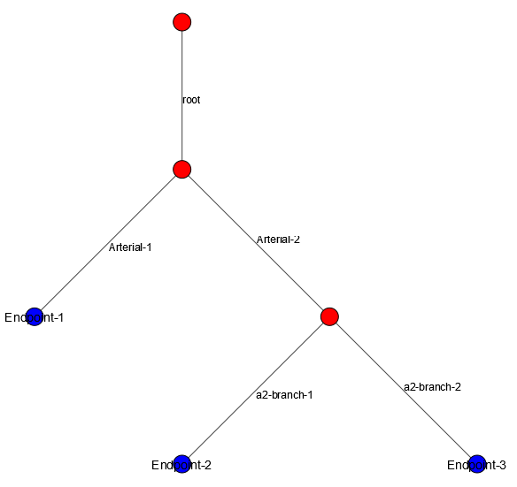

*****************
Simulation Models
*****************

This simulation requires input in the form of two *CSV* files: one for the pipe network and one for the flow diagram.

Pipe Network
************

To get started building a pipe network file, open a new *CSV* file or download the :download:`sample template <../examples/templates/pipefiletemplate.csv>` 
The first row (header) of the *CSV* file is as follows:

.. table::
   :widths: 40 40 40 40 40 40 40 40 40

   +----------+--------------+--------------------+-------------------+------------+----------+--------------+-----------+-----------+
   | **Name** | **Material** | **Width (inches)** | **Length (feet)** | **Parent** | **Root** | **Endpoint** | **D_INF** | **Alpha** |
   +----------+--------------+--------------------+-------------------+------------+----------+--------------+-----------+-----------+

If chlorine decay is selected, a free chlorine lambda column should be added to the end of the table.

If monocholorine network decay is selected add the following columns to the end of the table: kv1 Lambda, kv2 Lambda, kv3 Lambda, kv5 Lambda, kv7 Lambda, DOC1 Lambda, DOC2 Lambda

The line following the header contains information about the root pipe (the first pipe in the network). The format of this line follows that of the header:

.. table:: 
   :widths: 100 100 100 100 100 100 100 100 100 

   +------+---------+----------------+---------------+--------+------+----------+-------+-------+
   | root |   Pex   |       12       |      100      |  NONE  | TRUE |          | 0.019 |  114  |
   +------+---------+----------------+---------------+--------+------+----------+-------+-------+

The root node lists TRUE under the root column and has no entry in the Endpoint column. Since the root node has no parent, NONE is written in the parent column.

.. note::
   Note that the Parent, Root?, and Endpoint? entries are *case-sensitive*.

Each concurrent entry will describe the next connected pipe in the network. Let us explain how to create the model:

| root
| arterial-1
| arterial-2
| a2-branch-1
| a2-branch-2

This pipe network has three endpoints. One at the end of arterial-1, one at the end of a2-branch-1, and one at the end of a2-branch-2. You will need to explicitly state these endpoints and give them names in the model file, or else these pipes will be dead-ends.

We add lines describing the endpoints as follows:

| endpoint-1
| endpoint-2
| endpoint-3

Now our pipe network looks like:

With a visualization of the pipe network created, let's show how this network will be written into the pipe network model file.

.. tabularcolumns:: |p{1cm}|p{7cm}|

.. csv-table:: example-model.csv
   :file: ../examples/build-simulation-examples/docexample/example-model.csv
   :header-rows: 1
   :class: longtable
   :widths: auto
   
.. note::
   The first row of the pipe network spreadsheet must describe the root of the pipe network.

The columns of this table describe the following:

**Name**

The name of an individual pipe. Each name must be unique.

**Material**

The Material of the given pipe.

Pipes with the same material type must be given the same name. The program will group pipes by material type in order to measure residence times by material.

If describing an endpoint, input "NONE" into the pipe's corresponding material cell.

**Width**

The width of the given pipe in inches. 

**Length**

The length of the given pipe in feet.

**Parent**

The name of the pipe that is the parent of the given pipe. Multiple pipes may be connected to the same parent. Each individual pipe must have a single parent. 

If describing the root of a pipe network, input "NONE" into the pipe's corresponding parent cell. This row must be the first of the spreadsheet. 

Note that each pipe must appear below its parent in the pipe network file.

**Root?**

Indicates whether the given pipe is the root of the pipe network. Indicate "TRUE" in the Root? column of the first row of the spreadsheet, as this describes the root of the pipe network.

**Endpoint?**

Indicates whether the given pipe is an endpoint of the pipe network. Indicate "TRUE" in the Endpoint? column of each row describing an endpoint. Pipes designated as endpoints must not act as the parents of any other pipes in the network.

**D_INF**

The molecular diffusion coefficient of the given pipe. This value is used to calculate the diffusion of particles in the pipe network. This should be entered in units: cm^2/min. If making a simulation run without diffusion ebabled, this column may be left blank.

**Alpha**

The alpha value of the given pipe. This value is used in the calculation of diffusion for particles in the pipe network. This should be given in units of minutes. If making a simulation run without diffusion ebabled, this column may be left blank.

Optional Columns
^^^^^^^^^^^^^^^^

**Free Chlorine Lambda**
Lambdas for the given pipe affecting various chemical decay formulas given here.

**Monochloramine Lambdas**
kv1, kv2, kv3, kv5, kv7, DOC1, and DOC2 Lambdas affect monochloramine network decay formulas.

Flow Description
****************
To get started building a pipe network file, open a new <em>CSV</em> file or download the :download:`flows template <../examples/templates/flowstemplate.csv>` 

The first row (header) of the *CSV* file is as follows:

.. table::
   :widths: 50 50 50 50 50

   +--------------+----------------+--------------+--------------+------------------+
   | **Endpoint** | **Start Time** | **End Time** | **Flowrate** | **Sim Lifetime** | 
   +--------------+----------------+--------------+--------------+------------------+

The following rows describe the flow events occuring in the pipe system.

The first row following the header must also contain the total runtime of the simulation.

A completed flows spreadsheet will look something like the following: 

.. table::
   :widths: 40 40 40 40 40

   +----------+------------+----------+----------+--------------+
   | Endpoint | Start Time | End Time | Flowrate | Sim Lifetime | 
   +==========+============+==========+==========+==============+
   |endpoint-1| 0          | 120      | 5        | 24:00:00     |
   +----------+------------+----------+----------+--------------+
   |endpoint-2| 90         | 410      | 1        |              |
   +----------+------------+----------+----------+--------------+
   |endpoint-1| 900        | 1025     | 1.25     |              |
   +----------+------------+----------+----------+--------------+
   |endpoint-2| 1000       | 2000     | 1        |              |
   +----------+------------+----------+----------+--------------+
   |endpoint-1| 2480       | 3000     | 0.5      |              |
   +----------+------------+----------+----------+--------------+
   |endpoint-3| 500        | 900      | 1        |              |
   +----------+------------+----------+----------+--------------+

The columns of this table describe the following:

**Endpoint**

The name of the endpoint of the pipe network. This must match the name of an endpoint in the pipe network file. Each endpoint represents a tap in the pipe system.

**Start Time**

The time at which the tap opens. This value is given in minutes.

**End Time**

The time at which the tap closes. This value is given in minutes.

**Flowrate**

The flowrate of the tap. This value is given in gallons/minute.

**Sim Lifetime**

The total duration of the simulation. This value is given in days.
